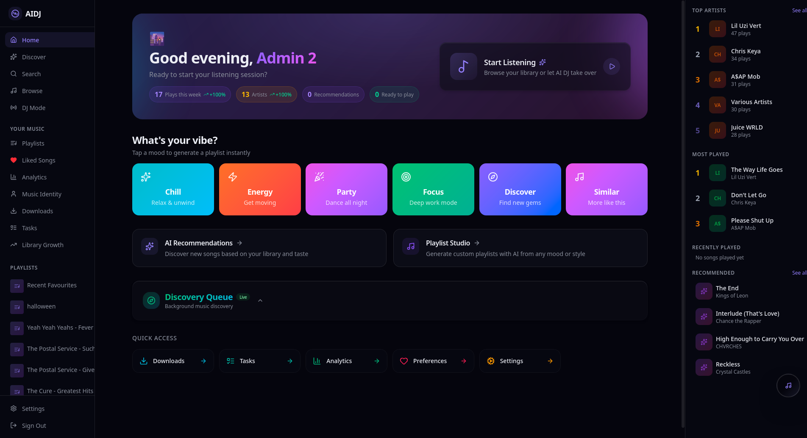
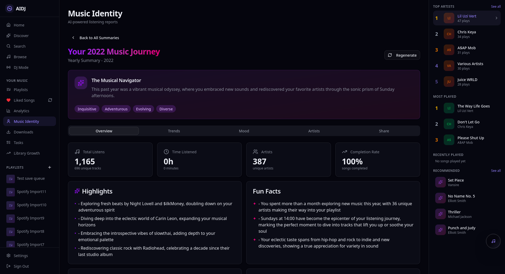
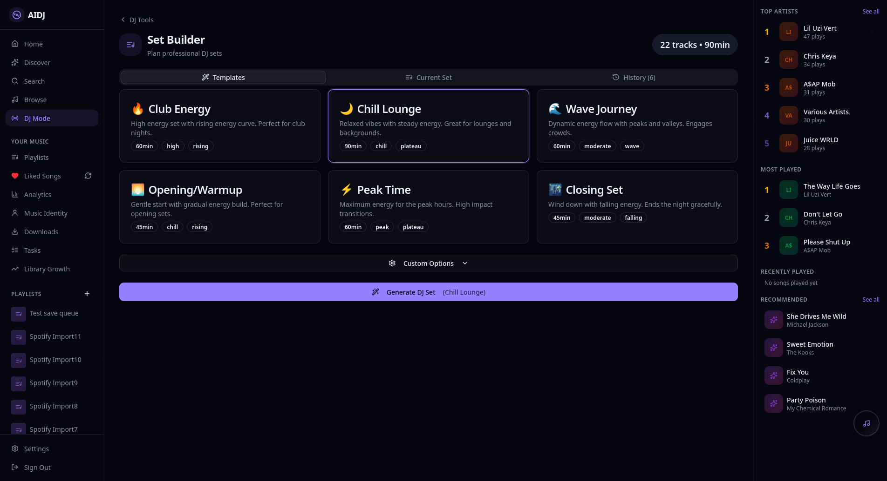
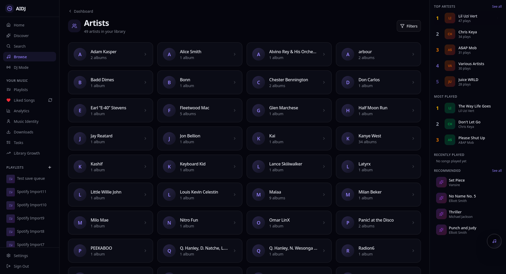
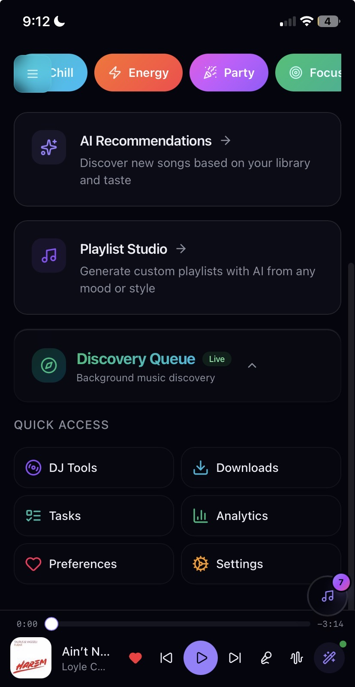
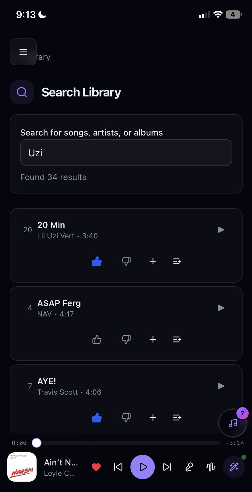
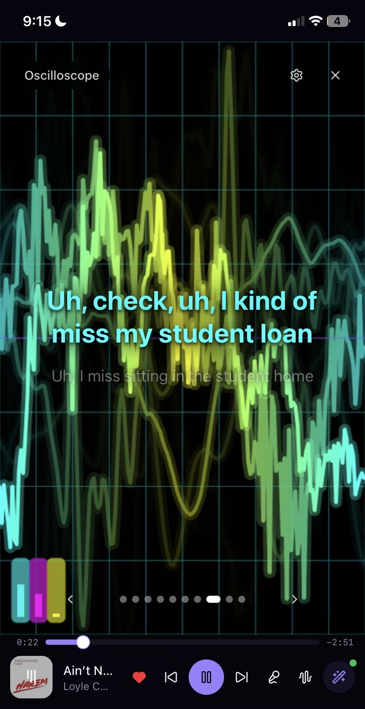

<h1 align="center">AIDJ</h1>
<p align="center"><strong>Self-hosted, AI-powered music command center</strong></p>

<p align="center">
  <a href="./LICENSE"></a>
  
  
  
  
</p>

<p align="center">
  
</p>

---

## Screenshots

<table>
  <tr>
    <td></td>
    <td></td>
  </tr>
  <tr>
    <td></td>
    <td></td>
  </tr>
</table>

<table>
  <tr>
    <td></td>
    <td></td>
    <td></td>
  </tr>
</table>

> [See full screenshot gallery](docs/screenshots/GALLERY.md)

---

## Features

### -- Music Library & Streaming

- Navidrome-integrated browsing (artists, albums, songs)
- Full-text search and album detail views
- Audio streaming proxy
- Background library sync & indexing

### -- Advanced Audio Player

- Dual-deck crossfade engine with gapless transitions
- 10 real-time audio visualizers (bars, waveform, circular, particles, starfield, spiral, and more)
- Lyrics display modal
- Network-resilient playback with stall recovery & auto-resume
- PWA with mobile controls & offline support

### -- AI DJ & Recommendations

- Multi-provider LLM support (Ollama, Anthropic, OpenRouter, GLM)
- Compound scoring engine (play history + similarity + genre + artist fatigue)
- DJ set builder with BPM analysis, harmonic mixing, energy flow
- Mix compatibility badges
- Background discovery with personalized suggestions
- Discovery feed with interaction tracking & analytics

### -- Music Identity (Spotify Wrapped-style)

- Listening hour distribution chart
- Album decade distribution
- Longest sessions tracker
- Artist interest trends over time
- Mood profile analysis
- Shareable identity cards with unique URLs

### -- Analytics Dashboard

- Play count & listening stats
- Mood timeline
- Seasonal patterns
- Library growth
- Discovery analytics (acceptance rate, genre exploration)
- Recommendation performance tracking

### -- Playlists

- Create, edit, drag-and-drop reorder
- Smart playlists with rule-based filters
- Collaborative playlists with real-time song suggestions
- Import/export (M3U, JSON)
- Navidrome two-way sync
- Liked songs sync

### -- Downloads & Acquisition

- YouTube audio downloads via MeTube
- Lidarr album search, monitoring, & acquisition
- Download queue management

---

## Tech Stack

| Layer | Technology |
|-------|-----------|
| Framework | [React 19](https://react.dev) + [React Compiler](https://react.dev/learn/react-compiler), [TanStack Start](https://tanstack.com/start/latest) / [Router](https://tanstack.com/router/latest) / [Query](https://tanstack.com/query/latest) |
| Styling | [Tailwind CSS v4](https://tailwindcss.com/) + [shadcn/ui](https://ui.shadcn.com/) + [Radix UI](https://www.radix-ui.com/) |
| State | [Zustand](https://zustand.docs.pmnd.rs/) |
| Database | [PostgreSQL](https://www.postgresql.org/) + [Drizzle ORM](https://orm.drizzle.team/) |
| Auth | [Better Auth](https://www.better-auth.com/) |
| Charts | [Recharts](https://recharts.org/) |
| Audio | Web Audio API, dual-deck crossfade engine |
| Testing | [Vitest](https://vitest.dev/) + [React Testing Library](https://testing-library.com/), [Playwright](https://playwright.dev/) E2E |
| CI/CD | GitHub Actions, Cloudflare Pages |

---

## Integrations

| Service | Purpose | Required |
|---------|---------|----------|
| [Navidrome](https://www.navidrome.org/) | Music library & streaming | Yes |
| [PostgreSQL](https://www.postgresql.org/) | Application database | Yes |
| [Last.fm](https://www.last.fm/) | Scrobbling, similar tracks, history backfill | Optional |
| [Lidarr](https://lidarr.audio/) | Music acquisition & monitoring | Optional |
| [MeTube](https://github.com/alexta69/MeTube) | YouTube audio downloads | Optional |
| [Ollama](https://ollama.com/) / LLM | AI DJ & recommendations | Optional |

---

## Getting Started

### Prerequisites

- Node.js 20+
- PostgreSQL
- Navidrome instance

### Setup

```bash
git clone https://github.com/lolimmlost/aidj.git
cd aidj
npm install
cp .env.example .env   # then edit with your service URLs and credentials
npm run db:push
npm run dev
```

The dev server starts at [http://localhost:3000](http://localhost:3000).

Optional services (Last.fm, Lidarr, MeTube, Ollama) can be configured later in Settings.

---

## Project Structure

```
src/
├── components/          # UI components
│   ├── dashboard/       # Dashboard widgets
│   ├── discovery/       # Discovery queue & suggestions
│   ├── discovery-feed/  # Discovery feed cards
│   ├── dj/              # DJ tools & mix badges
│   ├── downloads/       # Download management
│   ├── layout/          # PlayerBar, sidebar, nav
│   ├── library/         # Artist/album/song views
│   ├── lyrics/          # Lyrics modal
│   ├── music-identity/  # Wrapped-style analytics charts
│   ├── playlists/       # Playlist CRUD, collaboration, smart playlists
│   ├── recommendations/ # Rec cards, analytics, mood timeline
│   ├── ui/              # shadcn/ui primitives
│   └── visualizer/      # 10 audio visualizers
├── lib/
│   ├── auth/            # Better Auth config
│   ├── db/              # Drizzle schema & migrations
│   ├── services/        # Backend services (50+ modules)
│   │   ├── ai-dj/       # AI DJ core engine
│   │   ├── background-discovery/
│   │   ├── cache/       # Caching layer
│   │   ├── lastfm/      # Last.fm API client
│   │   ├── lidarr/      # Lidarr integration
│   │   ├── library-sync/# Navidrome sync
│   │   ├── llm/         # LLM providers (Ollama, Anthropic, OpenRouter, GLM)
│   │   └── offline/     # Offline/PWA support
│   └── stores/          # Zustand stores
├── routes/              # TanStack file-based routes
│   ├── (auth)/          # Login / Signup
│   ├── api/             # 80+ API endpoints
│   ├── dashboard/       # Dashboard, analytics, discover, mood
│   ├── dj/              # DJ set builder & settings
│   ├── downloads/       # Download management
│   ├── library/         # Artists / albums / search
│   ├── music-identity/  # Wrapped-style identity page
│   ├── playlists/       # Playlist views & collaboration
│   └── settings/        # Playback, services, profile, notifications
└── styles.css
```

---

## Development

```bash
npm run dev             # Start dev server
npm run build           # Production build
npm test                # Run tests (watch mode)
npm run test:coverage   # Run with coverage (>80% required)
npm run lint            # Lint with ESLint
```

CI runs lint, build, test, security scanning (Trivy + Gitleaks), and uploads coverage to Codecov on every push and PR. See [.github/workflows/README.md](.github/workflows/README.md) for details.

---

## License

[Unlicense](./LICENSE) -- public domain.
