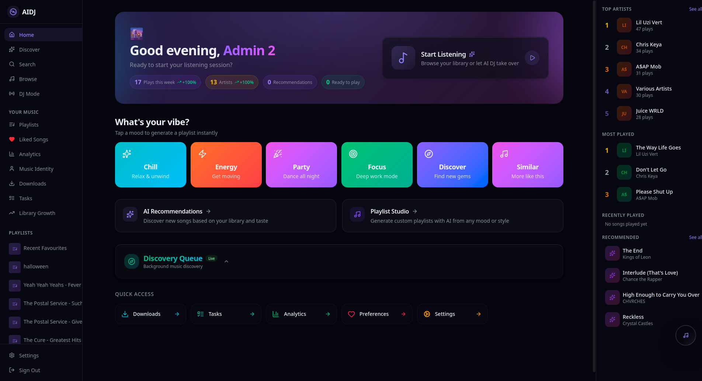
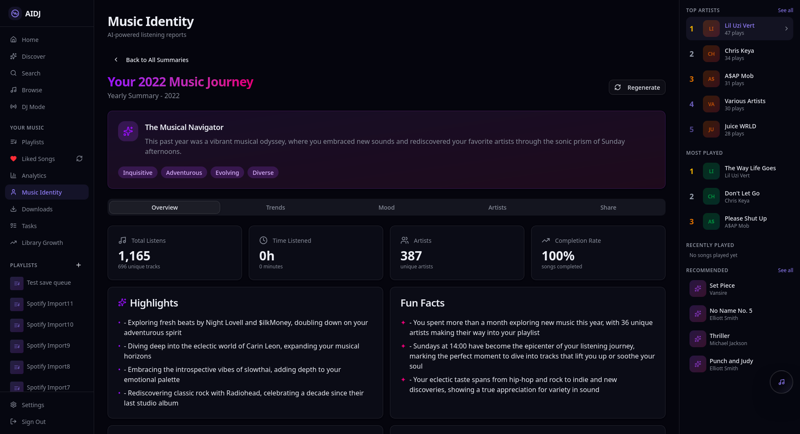
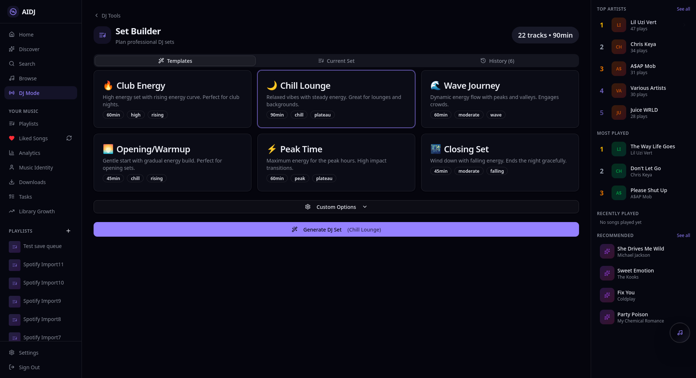
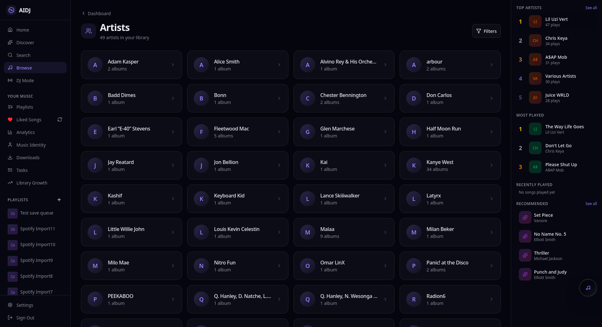
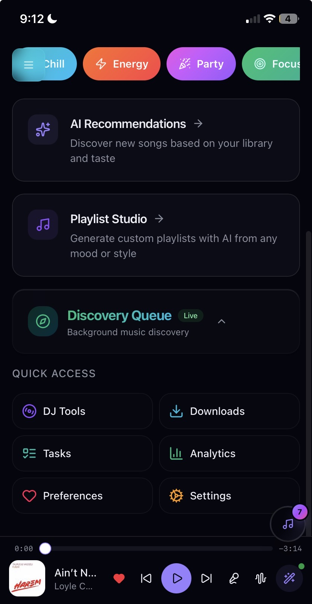
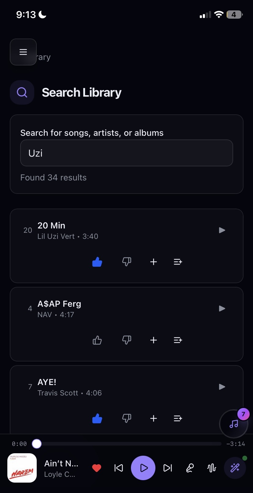
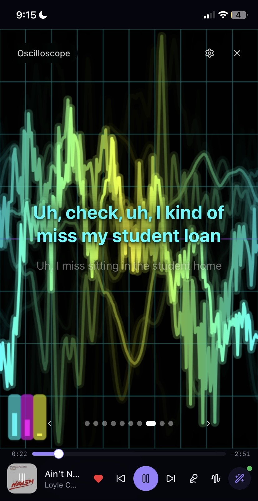

<h1 align="center">AIDJ</h1>
<p align="center"><strong>Self-hosted, AI-powered music command center</strong></p>

<p align="center">
  <a href="./LICENSE"></a>
  
  
  
  
</p>

<p align="center">
  
</p>

---

## Screenshots

<table>
  <tr>
    <td></td>
    <td></td>
  </tr>
  <tr>
    <td></td>
    <td></td>
  </tr>
</table>

<table>
  <tr>
    <td></td>
    <td></td>
    <td></td>
  </tr>
</table>

> [See full screenshot gallery](docs/screenshots/GALLERY.md)

---

## Features

### Music Library & Streaming

- Navidrome-integrated browsing (artists, albums, songs)
- Full-text search and album detail views
- Audio streaming proxy with quality selection (128/256/320 kbps)
- Background library sync & indexing
- Per-user Navidrome accounts (user-scoped stars, playlists, scrobbles)

### Advanced Audio Player

- Dual-deck crossfade engine with gapless transitions
- 10 real-time audio visualizers (bars, waveform, circular, particles, starfield, spiral, and more)
- Lyrics display via LRCLIB integration
- Network-resilient playback with stall recovery & auto-resume
- Keyboard shortcuts and Media Session API (lock screen / headphone controls)
- PWA with mobile controls & offline support

### Cross-Device Sync

- Spotify Connect-style device handoff via WebSocket
- Per-field timestamp conflict resolution
- Real-time queue, playback position, and volume sync across devices
- Device presence with heartbeat monitoring

### AI DJ & Recommendations

- Multi-provider LLM support (Ollama, Anthropic, OpenRouter, GLM)
- 7-signal blended scoring engine (Last.fm similarity, compound history, DJ match, feedback, skip penalty, temporal patterns, diversity)
- DJ set builder with BPM analysis, harmonic mixing, energy flow
- Mix compatibility badges
- Background discovery with personalized suggestions
- Discovery feed with interaction tracking & analytics
- Artist fatigue, blocklists, and seasonal pattern detection

### Music Identity (Spotify Wrapped-style)

- Listening hour distribution chart
- Album decade distribution
- Longest sessions tracker
- Artist interest trends over time
- Mood profile analysis
- Shareable identity cards with unique URLs

### Analytics Dashboard

- Play count & listening stats
- Mood timeline
- Seasonal patterns
- Library growth tracking
- Discovery analytics (acceptance rate, genre exploration)
- Recommendation performance tracking

### Playlists

- Create, edit, drag-and-drop reorder
- Smart playlists with rule-based filters
- Collaborative playlists with real-time song suggestions
- Import/export (M3U, JSON)
- Navidrome two-way sync
- Liked songs auto-sync from starred songs

### Content & Playback Controls

- Safe Mode (PG) -- filters explicit songs using Deezer metadata
- Configurable crossfade (0-10s), volume, autoplay, and quality defaults
- Per-user playback preferences synced to server

### Downloads & Acquisition

- YouTube audio downloads via MeTube
- Lidarr album search, monitoring, & acquisition
- Download queue management

---

## Tech Stack

| Layer | Technology |
|-------|-----------|
| Framework | [React 19](https://react.dev) + [React Compiler](https://react.dev/learn/react-compiler), [TanStack Start](https://tanstack.com/start/latest) / [Router](https://tanstack.com/router/latest) / [Query](https://tanstack.com/query/latest) |
| Styling | [Tailwind CSS v4](https://tailwindcss.com/) + [shadcn/ui](https://ui.shadcn.com/) + [Radix UI](https://www.radix-ui.com/) |
| State | [Zustand](https://zustand.docs.pmnd.rs/) (9 stores with persistence) |
| Database | [PostgreSQL](https://www.postgresql.org/) + [Drizzle ORM](https://orm.drizzle.team/) (20 schemas, 25 migrations) |
| Auth | [Better Auth](https://www.better-auth.com/) (email/password + GitHub + Google OAuth) |
| Charts | [Recharts](https://recharts.org/) |
| Audio | Web Audio API, dual-deck crossfade engine |
| Real-time | WebSocket (cross-device sync, collaborative playlists) |
| Testing | [Vitest](https://vitest.dev/) + [React Testing Library](https://testing-library.com/), [Playwright](https://playwright.dev/) E2E |
| CI/CD | GitHub Actions, Cloudflare Pages |

---

## Integrations

| Service | Purpose | Required |
|---------|---------|----------|
| [Navidrome](https://www.navidrome.org/) | Music library & streaming (Subsonic API) | Yes |
| [PostgreSQL](https://www.postgresql.org/) | Application database | Yes |
| [Ollama](https://ollama.com/) / [Anthropic](https://www.anthropic.com/) / [OpenRouter](https://openrouter.ai/) | AI DJ, mood translation, playlist generation | Optional |
| [Last.fm](https://www.last.fm/) | Similar tracks/artists, scrobbling metadata | Optional |
| [Lidarr](https://lidarr.audio/) | Music acquisition & monitoring | Optional |
| [MeTube](https://github.com/alexta69/MeTube) | YouTube audio downloads | Optional |
| [Spotify](https://developer.spotify.com/) | Metadata lookup (no streaming) | Optional |
| [Deezer](https://developers.deezer.com/) | Explicit content detection, cover art, metadata | Optional |
| [LRCLIB](https://lrclib.net/) | Synced lyrics lookup | Optional |

---

## Getting Started

### Prerequisites

- Node.js 20+
- PostgreSQL
- Navidrome instance

### Setup

```bash
git clone https://github.com/lolimmlost/aidj.git
cd aidj
npm install
cp .env.example .env   # then edit with your service URLs and credentials
npm run db             # generate and apply database migrations
npm run dev
```

The dev server starts at [http://localhost:3003](http://localhost:3003).

Optional services (Last.fm, Lidarr, MeTube, Ollama) can be configured later in Settings.

### Environment Variables

| Variable | Required | Description |
|----------|----------|-------------|
| `DATABASE_URL` | Yes | PostgreSQL connection URL |
| `BETTER_AUTH_SECRET` | Yes | Min 32 chars, session encryption |
| `VITE_BASE_URL` | Yes | Public URL (e.g., `https://example.com`) |
| `NAVIDROME_URL` | Yes | Navidrome server URL |
| `NAVIDROME_USERNAME` | Yes | Navidrome admin username |
| `NAVIDROME_PASSWORD` | Yes | Navidrome admin password |
| `OLLAMA_URL` | No | Ollama LLM server URL |
| `LIDARR_URL` | No | Lidarr server URL |
| `LIDARR_API_KEY` | No | Lidarr API key |
| `LASTFM_API_KEY` | No | Last.fm API key |
| `METUBE_URL` | No | MeTube server URL |
| `SPOTIFY_CLIENT_ID` | No | Spotify client credentials |
| `SPOTIFY_CLIENT_SECRET` | No | Spotify client credentials |
| `GITHUB_CLIENT_ID` | No | GitHub OAuth |
| `GITHUB_CLIENT_SECRET` | No | GitHub OAuth |
| `GOOGLE_CLIENT_ID` | No | Google OAuth |
| `GOOGLE_CLIENT_SECRET` | No | Google OAuth |

---

## Project Structure

```
src/
├── components/          # 125 React components
│   ├── dashboard/       # Dashboard widgets
│   ├── discovery/       # Discovery queue & suggestions
│   ├── discovery-feed/  # Discovery feed cards
│   ├── dj/              # DJ tools & mix badges
│   ├── downloads/       # Download management
│   ├── layout/          # PlayerBar, sidebar, nav
│   ├── library/         # Artist/album/song views
│   ├── lyrics/          # Lyrics modal
│   ├── music-identity/  # Wrapped-style analytics charts
│   ├── playlists/       # Playlist CRUD, collaboration, smart playlists
│   ├── recommendations/ # Rec cards, analytics, mood timeline
│   ├── ui/              # 37 shadcn/ui primitives
│   └── visualizer/      # Audio visualizer modal
├── lib/
│   ├── auth/            # Better Auth config
│   ├── config/          # Config & feature flag system
│   ├── db/schema/       # 20 Drizzle schema files
│   ├── hooks/           # 11 custom hooks (crossfade, sync, media session, etc.)
│   ├── services/        # 100 backend service modules
│   │   ├── ai-dj/       # AI DJ core engine
│   │   ├── background-discovery/
│   │   ├── cache/       # Caching layer
│   │   ├── lastfm/      # Last.fm API client
│   │   ├── lidarr/      # Lidarr integration
│   │   ├── library-sync/# Navidrome sync
│   │   ├── llm/         # LLM providers (Ollama, Anthropic, OpenRouter, GLM)
│   │   └── offline/     # Offline/PWA support
│   └── stores/          # 9 Zustand stores
├── routes/              # TanStack file-based routes
│   ├── (auth)/          # Login / Signup
│   ├── api/             # 114 API endpoints
│   ├── dashboard/       # Dashboard, analytics, discover, mood
│   ├── dj/              # DJ set builder & settings
│   ├── downloads/       # Download management
│   ├── library/         # Artists / albums / search
│   ├── music-identity/  # Wrapped-style identity page
│   ├── playlists/       # Playlist views & collaboration
│   ├── settings/        # Playback, services, profile, notifications
│   └── tasks/           # Background task management
└── styles.css
```

---

## Architecture

Detailed architecture documentation is auto-generated from the codebase:

| Document | Description |
|----------|-------------|
| [`SYSTEM-MAP.md`](docs/generated/SYSTEM-MAP.md) | Where everything is -- stores, schemas, routes, services, hooks, components |
| [`AUDIO-PLAYBACK.md`](docs/generated/AUDIO-PLAYBACK.md) | Dual-deck crossfade, audio store, stall recovery, cross-device sync |
| [`RECOMMENDATION-ENGINE.md`](docs/generated/RECOMMENDATION-ENGINE.md) | Scoring pipeline, weights, compound/skip/DJ formulas, discovery |
| [`DATA-MODEL.md`](docs/generated/DATA-MODEL.md) | Complete table reference with columns, types, indexes, relationships |
| [`EXTERNAL-INTEGRATIONS.md`](docs/generated/EXTERNAL-INTEGRATIONS.md) | Protocol, auth, config, and gotchas for each external service |
| [`CONVENTIONS.md`](docs/generated/CONVENTIONS.md) | Code patterns, naming, do/don't pairs with examples |

---

## Development

```bash
npm run dev             # Start dev server (port 3003)
npm run build           # Production build (node-server target)
npm test                # Run tests (watch mode)
npm run test:coverage   # Run with coverage (>80% required)
npm run lint            # Lint with ESLint
npm run db              # Generate & apply database migrations
npm run db:studio       # Open Drizzle Studio
```

CI runs lint, build, test, security scanning (Trivy + Gitleaks), and uploads coverage to Codecov on every push and PR. See [.github/workflows/README.md](.github/workflows/README.md) for details.

---

## License

[Unlicense](./LICENSE) -- public domain.
