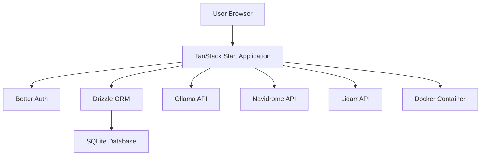
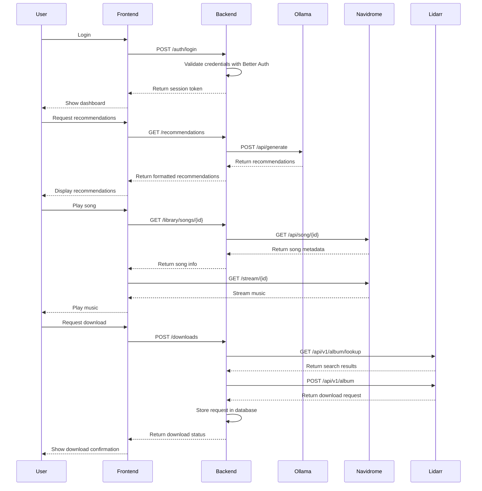
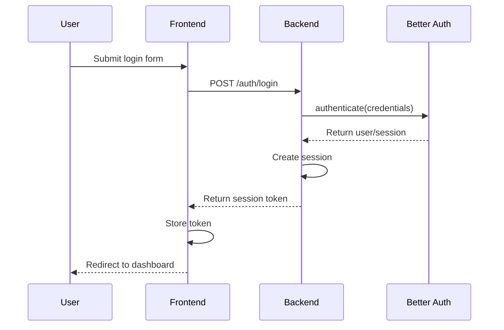
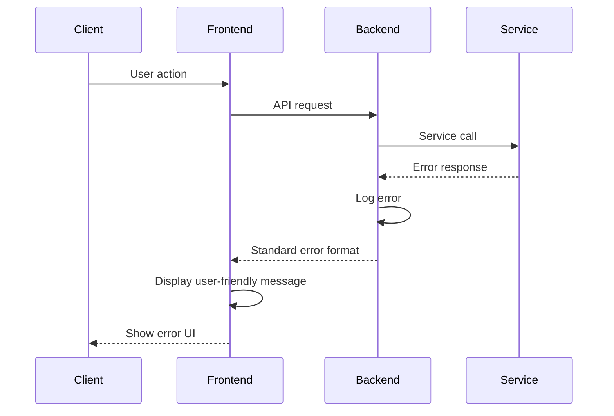

# Music Recommendation and Download Interface Fullstack Architecture Document

## Introduction

This document outlines the complete fullstack architecture for Music Recommendation and Download Interface, including backend systems, frontend implementation, and their integration. It serves as the single source of truth for AI-driven development, ensuring consistency across the entire technology stack.

This unified approach combines what would traditionally be separate backend and frontend architecture documents, streamlining the development process for modern fullstack applications where these concerns are increasingly intertwined.

### Starter Template or Existing Project

The project is based on a TanStack Start template with Better Auth and Drizzle ORM. This provides a modern full-stack React framework with server-side rendering capabilities, built-in authentication, and type-safe database interactions.

### Change Log
| Date | Version | Description | Author |
|------|---------|-------------|--------|
| 2025-09-06 | 1.0 | Initial architecture document | Architect |

## High Level Architecture

### Technical Summary

The architecture follows a monolithic approach within a monorepo structure, leveraging TanStack Start's full-stack capabilities. The frontend is built with React and TypeScript, utilizing TanStack Start's file-based routing and SSR features. The backend leverages TanStack Start's API routes for service integrations with Ollama, Navidrome, and Lidarr. Authentication is handled by Better Auth, providing secure session management. Database interactions use Drizzle ORM with SQLite for local storage of user preferences and settings. The application is designed for deployment as a single deployable unit with all functionality contained within the monorepo.

### Platform and Infrastructure Choice

**Platform:** Self-hosted deployment on local network
**Key Services:** 
- TanStack Start for fullstack framework
- Better Auth for authentication
- Drizzle ORM with SQLite for data storage
- Docker for containerization
**Deployment Host and Regions:** Local network deployment

### Repository Structure

**Structure:** Monorepo
**Monorepo Tool:** TanStack Start built-in monorepo support
**Package Organization:** 
- apps/web: Main frontend application
- packages/shared: Shared types and utilities
- packages/config: Shared configuration

### High Level Architecture Diagram


### Architectural Patterns

- **Monolithic Architecture:** Single deployable application that handles all functionality - _Rationale:_ Simplifies deployment and development for a personal application
- **Component-Based UI:** Reusable React components with TypeScript - _Rationale:_ Maintainability and type safety across the codebase
- **Repository Pattern:** Abstract data access logic through Drizzle ORM - _Rationale:_ Enables testing and future database migration flexibility
- **API Integration Pattern:** Direct service integrations within TanStack Start API routes - _Rationale:_ Leverages framework capabilities for server-side API calls

## Tech Stack

### Technology Stack Table
| Category | Technology | Version | Purpose | Rationale |
|----------|------------|---------|---------|-----------|
| Frontend Language | TypeScript | 5.x | Type-safe JavaScript development | Improved developer experience and error prevention |
| Frontend Framework | TanStack Start | Latest | Fullstack React framework with SSR | Modern framework with built-in routing and API routes |
| UI Component Library | Tailwind CSS | 3.x | Utility-first CSS framework | Rapid UI development with consistent design |
| State Management | TanStack Query | Latest | Server state management | Built-in TanStack Start integration for API data |
| Backend Language | TypeScript | 5.x | Type-safe server-side development | Consistency with frontend and improved error prevention |
| Backend Framework | TanStack Start | Latest | Fullstack framework with API routes | Unified framework for both frontend and backend |
| API Style | REST | N/A | API communication | Standard approach compatible with all services |
| Database | SQLite | 3.x | Local data storage | Lightweight, file-based database perfect for local applications |
| Cache | In-memory | N/A | Temporary data storage | Simple caching solution for a local application |
| File Storage | Local filesystem | N/A | Music file storage | Leveraging existing Navidrome and Lidarr storage |
| Authentication | Better Auth | Latest | User authentication | Comprehensive auth solution with built-in TanStack Start support |
| Frontend Testing | Vitest + React Testing Library | Latest | Frontend unit and integration testing | Built-in TanStack Start testing support |
| Backend Testing | Vitest | Latest | Backend unit and integration testing | Consistent testing framework across stack |
| E2E Testing | Playwright | Latest | End-to-end testing | Comprehensive browser automation |
| Build Tool | Vite | Latest | Fast builds | Built-in TanStack Start support |
| Bundler | Vite | Latest | Module bundling | Built-in TanStack Start support |
| IaC Tool | Docker | Latest | Containerization | Simple deployment for local applications |
| CI/CD | GitHub Actions | Latest | Automated testing and deployment | Integrated with GitHub repositories |
| Monitoring | None | N/A | Application monitoring | Not required for local application |
| Logging | Pino | Latest | Structured logging | Fast, lightweight logging solution |
| CSS Framework | Tailwind CSS | 3.x | Utility-first styling | Rapid UI development with consistent design |

## Data Models

### User
**Purpose:** Represents an authenticated user of the application

**Key Attributes:**
- id: string - Unique identifier for the user
- email: string - User's email address
- name: string - User's display name
- createdAt: Date - When the user account was created

```typescript
interface User {
  id: string;
  email: string;
  name: string;
  createdAt: Date;
}
```

**Relationships:**
- One-to-many with UserPreferences
- One-to-many with DownloadRequests

### UserPreferences
**Purpose:** Stores user-specific preferences for the application

**Key Attributes:**
- id: string - Unique identifier for the preference record
- userId: string - Reference to the user
- recommendationSettings: JSON - AI recommendation preferences
- playbackSettings: JSON - Music playback preferences
- downloadSettings: JSON - Download preferences

```typescript
interface UserPreferences {
  id: string;
  userId: string;
  recommendationSettings: Record<string, any>;
  playbackSettings: Record<string, any>;
  downloadSettings: Record<string, any>;
}
```

**Relationships:**
- Many-to-one with User

### DownloadRequest
**Purpose:** Tracks requests for music downloads through Lidarr

**Key Attributes:**
- id: string - Unique identifier for the download request
- userId: string - Reference to the user who made the request
- title: string - Title of the requested music
- artist: string - Artist of the requested music
- status: string - Current status of the download (requested, downloading, completed, failed)
- requestedAt: Date - When the download was requested
- completedAt: Date - When the download completed (if applicable)

```typescript
interface DownloadRequest {
  id: string;
  userId: string;
  title: string;
  artist: string;
  status: 'requested' | 'downloading' | 'completed' | 'failed';
  requestedAt: Date;
  completedAt?: Date;
}
```

**Relationships:**
- Many-to-one with User

## API Specification

### REST API Specification
```yaml
openapi: 3.0.0
info:
  title: Music Recommendation and Download Interface API
  version: 1.0.0
  description: API for managing music recommendations, playback, and downloads
servers:
  - url: http://localhost:3000/api
    description: Local development server
paths:
  /auth/login:
    post:
      summary: User login
      requestBody:
        required: true
        content:
          application/json:
            schema:
              type: object
              properties:
                email:
                  type: string
                password:
                  type: string
      responses:
        '200':
          description: Successful login
          content:
            application/json:
              schema:
                type: object
                properties:
                  token:
                    type: string
  /auth/logout:
    post:
      summary: User logout
      responses:
        '200':
          description: Successful logout
  /recommendations:
    get:
      summary: Get music recommendations
      parameters:
        - name: limit
          in: query
          schema:
            type: integer
      responses:
        '200':
          description: List of recommendations
          content:
            application/json:
              schema:
                type: array
                items:
                  type: object
                  properties:
                    id:
                      type: string
                    title:
                      type: string
                    artist:
                      type: string
                    reason:
                      type: string
  /library/artists:
    get:
      summary: Get list of artists
      responses:
        '200':
          description: List of artists
          content:
            application/json:
              schema:
                type: array
                items:
                  type: object
                  properties:
                    id:
                      type: string
                    name:
                      type: string
  /library/albums:
    get:
      summary: Get list of albums
      parameters:
        - name: artistId
          in: query
          schema:
            type: string
      responses:
        '200':
          description: List of albums
          content:
            application/json:
              schema:
                type: array
                items:
                  type: object
                  properties:
                    id:
                      type: string
                    title:
                      type: string
                    artist:
                      type: string
  /library/songs:
    get:
      summary: Get list of songs
      parameters:
        - name: albumId
          in: query
          schema:
            type: string
      responses:
        '200':
          description: List of songs
          content:
            application/json:
              schema:
                type: array
                items:
                  type: object
                  properties:
                    id:
                      type: string
                    title:
                      type: string
                    artist:
                      type: string
                    album:
                      type: string
  /downloads:
    get:
      summary: Get download requests
      responses:
        '200':
          description: List of download requests
          content:
            application/json:
              schema:
                type: array
                items:
                  $ref: '#/components/schemas/DownloadRequest'
    post:
      summary: Create download request
      requestBody:
        required: true
        content:
          application/json:
            schema:
              type: object
              properties:
                title:
                  type: string
                artist:
                  type: string
      responses:
        '201':
          description: Download request created
          content:
            application/json:
              schema:
                $ref: '#/components/schemas/DownloadRequest'
  /downloads/{id}:
    get:
      summary: Get download request status
      parameters:
        - name: id
          in: path
          required: true
          schema:
            type: string
      responses:
        '200':
          description: Download request details
          content:
            application/json:
              schema:
                $ref: '#/components/schemas/DownloadRequest'
components:
  schemas:
    DownloadRequest:
      type: object
      properties:
        id:
          type: string
        userId:
          type: string
        title:
          type: string
        artist:
          type: string
        status:
          type: string
          enum: [requested, downloading, completed, failed]
        requestedAt:
          type: string
          format: date-time
        completedAt:
          type: string
          format: date-time
          nullable: true
```

## Components

### Frontend Components

**Responsibility:** User interface for music discovery, playback, and download management

**Key Interfaces:**
- React components for UI rendering
- TanStack Query hooks for data fetching
- Service functions for API communication

**Dependencies:** 
- TanStack Start frontend framework
- Tailwind CSS for styling
- TanStack Query for data management

**Technology Stack:** 
- React with TypeScript
- TanStack Start file-based routing
- Tailwind CSS for styling
- TanStack Query for server state management

### Backend API Routes

**Responsibility:** Server-side API endpoints for authentication, recommendations, library management, and download requests

**Key Interfaces:**
- REST API endpoints for frontend communication
- Service functions for external API integrations
- Database access functions through Drizzle ORM

**Dependencies:** 
- TanStack Start API routes
- Better Auth for authentication
- Drizzle ORM for database access
- External service APIs (Ollama, Navidrome, Lidarr)

**Technology Stack:** 
- TanStack Start API routes
- Better Auth for authentication
- Drizzle ORM with SQLite
- Axios for external API calls

### Authentication Service

**Responsibility:** User authentication and session management

**Key Interfaces:**
- Login and logout endpoints
- Session validation middleware
- User management functions

**Dependencies:** 
- Better Auth library
- Database for user storage

**Technology Stack:** 
- Better Auth
- Drizzle ORM for database access

### Recommendation Service

**Responsibility:** Integration with Ollama for music recommendations

**Key Interfaces:**
- Function to generate recommendations
- Error handling for API failures

**Dependencies:** 
- Ollama API
- User preferences from database

**Technology Stack:** 
- Axios for API communication
- Drizzle ORM for accessing user preferences

### Library Service

**Responsibility:** Integration with Navidrome for music library access

**Key Interfaces:**
- Functions to retrieve artists, albums, and songs
- Music streaming functionality
- Authentication with Navidrome

**Dependencies:** 
- Navidrome API
- User credentials

**Technology Stack:** 
- Axios for API communication
- Stream handling for music playback

### Download Service

**Responsibility:** Integration with Lidarr for download management

**Key Interfaces:**
- Functions to search for and request downloads
- Status monitoring for download requests
- API key authentication with Lidarr

**Dependencies:** 
- Lidarr API
- User preferences for API configuration

**Technology Stack:** 
- Axios for API communication
- Drizzle ORM for storing download requests

## External APIs

### Ollama API
- **Purpose:** Generate AI music recommendations
- **Documentation:** https://github.com/ollama/ollama/blob/main/docs/api.md
- **Base URL(s):** http://[LAN_IP]:11434/api
- **Authentication:** None (local instance)
- **Rate Limits:** None specified for local instances

**Key Endpoints Used:**
- `POST /generate` - Generate music recommendations

**Integration Notes:** 
- Need to format prompts appropriately for music recommendations
- Handle model loading delays
- Implement caching for recommendations

### Navidrome API
- **Purpose:** Access music library and streaming
- **Documentation:** https://www.navidrome.org/docs/developer/api/
- **Base URL(s):** http://[LAN_IP]:4533/api
- **Authentication:** Token-based authentication
- **Rate Limits:** None specified

**Key Endpoints Used:**
- `POST /auth/login` - Authenticate with Navidrome
- `GET /song` - Retrieve song list
- `GET /artist` - Retrieve artist list
- `GET /album` - Retrieve album list
- `GET /stream/{id}` - Stream music

**Integration Notes:** 
- Handle token refresh for long sessions
- Implement pagination for large collections
- Handle streaming with proper buffering

### Lidarr API
- **Purpose:** Search for and request music downloads
- **Documentation:** https://lidarr.audio/docs/api/
- **Base URL(s):** http://[LAN_IP]:8686/api/v1
- **Authentication:** API key in header
- **Rate Limits:** None specified

**Key Endpoints Used:**
- `GET /album/lookup` - Search for albums
- `POST /album` - Request album download
- `GET /queue` - Check download status

**Integration Notes:** 
- Secure storage of API key
- Handle different quality profiles
- Implement status polling for download progress

## Core Workflows



## Database Schema

```sql
CREATE TABLE users (
    id TEXT PRIMARY KEY,
    email TEXT UNIQUE NOT NULL,
    name TEXT NOT NULL,
    created_at DATETIME DEFAULT CURRENT_TIMESTAMP
);

CREATE TABLE user_preferences (
    id TEXT PRIMARY KEY,
    user_id TEXT NOT NULL,
    recommendation_settings TEXT,
    playback_settings TEXT,
    download_settings TEXT,
    FOREIGN KEY (user_id) REFERENCES users(id)
);

CREATE TABLE download_requests (
    id TEXT PRIMARY KEY,
    user_id TEXT NOT NULL,
    title TEXT NOT NULL,
    artist TEXT NOT NULL,
    status TEXT NOT NULL,
    requested_at DATETIME DEFAULT CURRENT_TIMESTAMP,
    completed_at DATETIME,
    FOREIGN KEY (user_id) REFERENCES users(id)
);

CREATE INDEX idx_download_requests_user_id ON download_requests(user_id);
CREATE INDEX idx_download_requests_status ON download_requests(status);
```

## Frontend Architecture

### Component Architecture

#### Component Organization
```
src/
├── components/           # Shared components
│   ├── layout/           # Layout components
│   ├── music/            # Music-specific components
│   └── ui/               # Generic UI components
├── routes/               # File-based routes
├── services/             # API service functions
├── stores/               # Global state stores
├── styles/               # Global styles
└── utils/                # Utility functions
```

#### Component Template
```typescript
import { ComponentProps } from 'react';

interface Props extends ComponentProps<'div'> {
  // Component-specific props
}

export function MyComponent({ children, ...props }: Props) {
  return (
    <div {...props}>
      {children}
    </div>
  );
}
```

### State Management Architecture

#### State Structure
```typescript
interface AppState {
  auth: {
    user: User | null;
    isAuthenticated: boolean;
  };
  music: {
    currentTrack: Track | null;
    isPlaying: boolean;
    volume: number;
  };
  downloads: {
    requests: DownloadRequest[];
    isLoading: boolean;
  };
}
```

#### State Management Patterns
- Use TanStack Query for server state
- Use component local state for UI state
- Lift state up when needed by multiple components

### Routing Architecture

#### Route Organization
```
routes/
├── __root.tsx            # Root layout
├── index.tsx             # Dashboard
├── login.tsx             # Login page
├── library/
│   ├── index.tsx         # Library overview
│   ├── artists.tsx       # Artists list
│   ├── albums.tsx        # Albums list
│   └── songs.tsx         # Songs list
├── recommendations/
│   ├── index.tsx         # Recommendations feed
│   └── [id].tsx          # Recommendation detail
├── downloads/
│   ├── index.tsx         # Download queue
│   └── history.tsx       # Download history
└── settings/
    ├── index.tsx         # Settings overview
    ├── profile.tsx       # User profile
    └── services.tsx      # Service configuration
```

#### Protected Route Pattern
```typescript
import { createFileRoute, redirect } from '@tanstack/react-router';

export const Route = createFileRoute('/protected')({
  beforeLoad: ({ context }) => {
    if (!context.auth.isAuthenticated) {
      throw redirect({
        to: '/login',
        search: {
          redirect: location.href,
        }
      });
    }
  },
  component: ProtectedComponent,
});
```

### Frontend Services Layer

#### API Client Setup
```typescript
import axios from 'axios';

const apiClient = axios.create({
  baseURL: '/api',
  timeout: 10000,
});

apiClient.interceptors.request.use((config) => {
  const token = localStorage.getItem('authToken');
  if (token) {
    config.headers.Authorization = `Bearer ${token}`;
  }
  return config;
});

export default apiClient;
```

#### Service Example
```typescript
import apiClient from './apiClient';

export const recommendationService = {
  getRecommendations: async (limit = 10) => {
    const response = await apiClient.get('/recommendations', {
      params: { limit }
    });
    return response.data;
  }
};
```

## Backend Architecture

### Service Architecture

#### Traditional Server Architecture

##### Controller/Route Organization
```
src/
├── routes/
│   ├── auth.ts           # Authentication routes
│   ├── recommendations.ts # Recommendation routes
│   ├── library.ts        # Library routes
│   └── downloads.ts      # Download routes
├── services/
│   ├── auth.ts           # Authentication service
│   ├── ollama.ts         # Ollama integration
│   ├── navidrome.ts      # Navidrome integration
│   └── lidarr.ts         # Lidarr integration
├── models/
│   ├── user.ts           # User model
│   └── download.ts       # Download model
├── middleware/
│   └── auth.ts           # Authentication middleware
└── utils/
    └── database.ts       # Database utilities
```

##### Controller Template
```typescript
import { json, type RequestHandler } from '@tanstack/start';
import { z } from 'zod';
import { getRecommendations } from '~/services/ollama';

const recommendationSchema = z.object({
  limit: z.number().min(1).max(50).default(10),
});

export const GET: RequestHandler = async ({ request }) => {
  const url = new URL(request.url);
  const limit = parseInt(url.searchParams.get('limit') || '10');
  
  try {
    const recommendations = await getRecommendations(limit);
    return json({ recommendations });
  } catch (error) {
    return json({ error: 'Failed to fetch recommendations' }, { status: 500 });
  }
};
```

### Database Architecture

#### Schema Design
```sql
CREATE TABLE users (
    id TEXT PRIMARY KEY,
    email TEXT UNIQUE NOT NULL,
    name TEXT NOT NULL,
    created_at DATETIME DEFAULT CURRENT_TIMESTAMP
);

CREATE TABLE user_preferences (
    id TEXT PRIMARY KEY,
    user_id TEXT NOT NULL,
    recommendation_settings TEXT,
    playback_settings TEXT,
    download_settings TEXT,
    FOREIGN KEY (user_id) REFERENCES users(id)
);

CREATE TABLE download_requests (
    id TEXT PRIMARY KEY,
    user_id TEXT NOT NULL,
    title TEXT NOT NULL,
    artist TEXT NOT NULL,
    status TEXT NOT NULL,
    requested_at DATETIME DEFAULT CURRENT_TIMESTAMP,
    completed_at DATETIME,
    FOREIGN KEY (user_id) REFERENCES users(id)
);
```

#### Data Access Layer
```typescript
import { db } from '~/utils/database';
import { users, userPreferences, downloadRequests } from '~/models/schema';
import { eq } from 'drizzle-orm';

export const userRepo = {
  findById: async (id: string) => {
    return await db.select().from(users).where(eq(users.id, id)).get();
  },
  
  create: async (userData: typeof users.$inferInsert) => {
    return await db.insert(users).values(userData).returning().get();
  }
};

export const downloadRepo = {
  findByUserId: async (userId: string) => {
    return await db.select().from(downloadRequests).where(eq(downloadRequests.userId, userId)).all();
  },
  
  create: async (downloadData: typeof downloadRequests.$inferInsert) => {
    return await db.insert(downloadRequests).values(downloadData).returning().get();
  }
};
```

### Authentication and Authorization

#### Auth Flow


#### Middleware/Guards
```typescript
import { betterAuth } from 'better-auth';
import { getSession } from 'better-auth/api';

export async function authMiddleware(request: Request) {
  const session = await getSession(request, auth);
  
  if (!session) {
    return new Response('Unauthorized', { status: 401 });
  }
  
  return { user: session.user };
}
```

## Unified Project Structure

```
music-interface/
├── .github/
│   └── workflows/
│       ├── ci.yaml
│       └── deploy.yaml
├── apps/
│   └── web/                    # TanStack Start application
│       ├── src/
│       │   ├── components/     # Shared components
│       │   ├── routes/         # File-based routes
│       │   ├── services/       # API service functions
│       │   ├── stores/         # Global state stores
│       │   ├── styles/         # Global styles
│       │   └── utils/          # Utility functions
│       ├── public/             # Static assets
│       ├── tests/              # Application tests
│       └── package.json
├── packages/
│   └── shared/                 # Shared types and utilities
│       ├── src/
│       │   ├── types/          # TypeScript interfaces
│       │   ├── constants/      # Shared constants
│       │   └── utils/          # Shared utilities
│       └── package.json
├── infrastructure/
│   └── docker/
│       └── Dockerfile
├── scripts/                    # Build/deploy scripts
├── docs/                       # Documentation
│   ├── project-brief.md
│   ├── technical-requirements.md
│   ├── prd.md
│   ├── front-end-spec.md
│   └── architecture.md
├── .env.example                # Environment template
├── package.json                # Root package.json
├── tsconfig.json               # TypeScript configuration
└── README.md
```

## Development Workflow

### Local Development Setup

#### Prerequisites
```bash
# Install Node.js (version 18 or higher)
# Install Docker (for containerization)
# Install Git
```

#### Initial Setup
```bash
# Clone repository
git clone [repository-url]

# Install dependencies
npm install

# Set up environment variables
cp .env.example .env
# Edit .env with your service configurations

# Initialize database
npm run db:push
```

#### Development Commands
```bash
# Start all services
npm run dev

# Run tests
npm run test

# Run tests with coverage
npm run test:coverage

# Lint code
npm run lint

# Format code
npm run format
```

### Environment Configuration

#### Required Environment Variables
```bash
# Frontend (.env)
VITE_OLLAMA_URL=http://localhost:11434
VITENAVIDROME_URL=http://localhost:4533
VITE_LIDARR_URL=http://localhost:8686

# Backend (.env)
DATABASE_URL=sqlite.db
AUTH_SECRET=your-super-secret-auth-secret
OLLAMA_URL=http://localhost:11434
NAVIDROME_URL=http://localhost:4533
LIDARR_API_KEY=your-lidarr-api-key
LIDARR_URL=http://localhost:8686
```

## Deployment Architecture

### Deployment Strategy

**Frontend Deployment:**
- **Platform:** Docker container
- **Build Command:** npm run build
- **Output Directory:** dist
- **CDN/Edge:** None (local deployment)

**Backend Deployment:**
- **Platform:** Docker container
- **Build Command:** npm run build
- **Deployment Method:** Docker image

### CI/CD Pipeline
```yaml
name: CI/CD Pipeline

on:
  push:
    branches: [main]
  pull_request:
    branches: [main]

jobs:
  test:
    runs-on: ubuntu-latest
    steps:
      - uses: actions/checkout@v3
      - uses: actions/setup-node@v3
        with:
          node-version: '18'
      - run: npm install
      - run: npm run test

  build:
    needs: test
    runs-on: ubuntu-latest
    steps:
      - uses: actions/checkout@v3
      - uses: actions/setup-node@v3
        with:
          node-version: '18'
      - run: npm install
      - run: npm run build
      - run: docker build -t music-interface .

  deploy:
    needs: build
    runs-on: ubuntu-latest
    steps:
      - run: docker run -d -p 3000:3000 music-interface
```

### Environments
| Environment | Frontend URL | Backend URL | Purpose |
|-------------|--------------|-------------|---------|
| Development | http://localhost:3000 | http://localhost:3000/api | Local development |
| Production | http://[LAN_IP]:3000 | http://[LAN_IP]:3000/api | Live environment |

## Security and Performance

### Security Requirements

**Frontend Security:**
- CSP Headers: Default TanStack Start CSP
- XSS Prevention: React's built-in protection
- Secure Storage: localStorage for non-sensitive data only

**Backend Security:**
- Input Validation: Zod schema validation
- Rate Limiting: None (local application)
- CORS Policy: Restrict to same origin

**Authentication Security:**
- Token Storage: HttpOnly cookies
- Session Management: Better Auth sessions
- Password Policy: Minimum 8 characters

### Performance Optimization

**Frontend Performance:**
- Bundle Size Target: < 2MB
- Loading Strategy: Code splitting with TanStack Start
- Caching Strategy: TanStack Query caching

**Backend Performance:**
- Response Time Target: < 500ms
- Database Optimization: Indexes on frequently queried columns
- Caching Strategy: In-memory caching for recommendations

## Testing Strategy

### Testing Pyramid
```
E2E Tests
/        \
Integration Tests
/            \
Frontend Unit  Backend Unit
```

### Test Organization

#### Frontend Tests
```
src/
├── components/
│   └── __tests__/
├── routes/
│   └── __tests__/
├── services/
│   └── __tests__/
└── utils/
    └── __tests__/
```

#### Backend Tests
```
src/
├── routes/
│   └── __tests__/
├── services/
│   └── __tests__/
├── models/
│   └── __tests__/
└── utils/
    └── __tests__/
```

#### E2E Tests
```
tests/
├── auth/
├── library/
├── recommendations/
└── downloads/
```

### Test Examples

#### Frontend Component Test
```typescript
import { render, screen } from '@testing-library/react';
import { MusicPlayer } from './MusicPlayer';

describe('MusicPlayer', () => {
  it('renders play button when not playing', () => {
    render(<MusicPlayer isPlaying={false} />);
    expect(screen.getByLabelText('Play')).toBeInTheDocument();
  });
});
```

#### Backend API Test
```typescript
import { describe, it, expect } from 'vitest';
import { GET } from './recommendations';

describe('Recommendations API', () => {
  it('returns recommendations with default limit', async () => {
    const request = new Request('http://localhost:3000/api/recommendations');
    const response = await GET({ request });
    const data = await response.json();
    
    expect(response.status).toBe(200);
    expect(Array.isArray(data.recommendations)).toBe(true);
  });
});
```

#### E2E Test
```typescript
import { test, expect } from '@playwright/test';

test('user can login and see dashboard', async ({ page }) => {
  await page.goto('/login');
  await page.fill('input[name="email"]', 'test@example.com');
  await page.fill('input[name="password"]', 'password');
  await page.click('button[type="submit"]');
  
  await expect(page).toHaveURL('/dashboard');
  await expect(page.getByText('Recommendations')).toBeVisible();
});
```

## Coding Standards

### Critical Fullstack Rules
- **Type Sharing:** Always define types in packages/shared and import from there
- **API Calls:** Never make direct HTTP calls - use the service layer
- **Environment Variables:** Access only through config objects, never process.env directly
- **Error Handling:** All API routes must use the standard error handler
- **State Updates:** Never mutate state directly - use proper state management patterns

### Naming Conventions
| Element | Frontend | Backend | Example |
|---------|----------|---------|---------|
| Components | PascalCase | - | `UserProfile.tsx` |
| Hooks | camelCase with 'use' | - | `useAuth.ts` |
| API Routes | - | kebab-case | `/api/user-profile` |
| Database Tables | - | snake_case | `user_profiles` |

## Error Handling Strategy

### Error Flow


### Error Response Format
```typescript
interface ApiError {
  error: {
    code: string;
    message: string;
    details?: Record<string, any>;
    timestamp: string;
    requestId: string;
  };
}
```

### Frontend Error Handling
```typescript
import { useQuery } from '@tanstack/react-query';

function useRecommendations() {
  return useQuery({
    queryKey: ['recommendations'],
    queryFn: () => fetch('/api/recommendations').then(res => res.json()),
    onError: (error) => {
      // Log error and show user-friendly message
      console.error('Failed to fetch recommendations:', error);
      // Show toast or other UI feedback
    }
  });
}
```

### Backend Error Handling
```typescript
import { json } from '@tanstack/start';

export function createError(code: string, message: string, status = 500) {
  return json({
    error: {
      code,
      message,
      timestamp: new Date().toISOString(),
      requestId: crypto.randomUUID()
    }
  }, { status });
}

// Usage in route handler
export const GET: RequestHandler = async () => {
  try {
    const recommendations = await getRecommendations();
    return json({ recommendations });
  } catch (error) {
    return createError('RECOMMENDATION_FAILED', 'Failed to fetch recommendations', 500);
  }
};
```

## Monitoring and Observability

### Monitoring Stack
- **Frontend Monitoring:** None (local application)
- **Backend Monitoring:** Pino logging
- **Error Tracking:** Console logging
- **Performance Monitoring:** None (local application)

### Key Metrics

**Frontend Metrics:**
- Core Web Vitals
- JavaScript errors
- API response times
- User interactions

**Backend Metrics:**
- Request rate
- Error rate
- Response time
- Database query performance

## Checklist Results Report
To be completed after architecture review and approval.