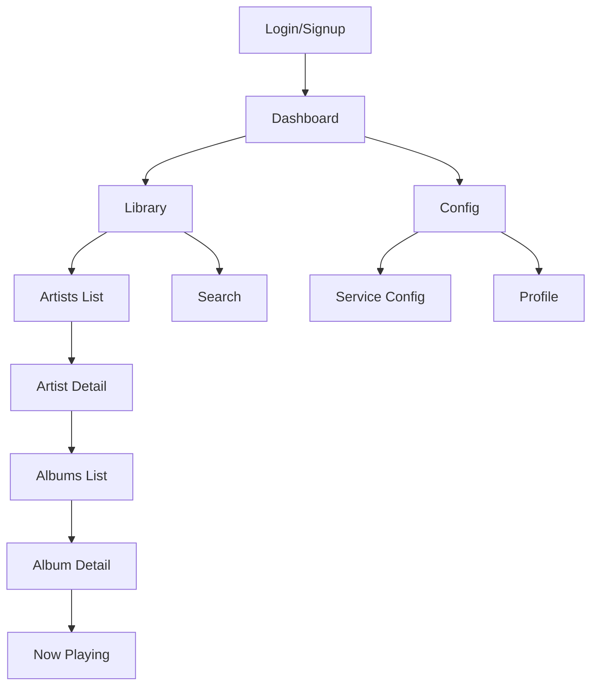
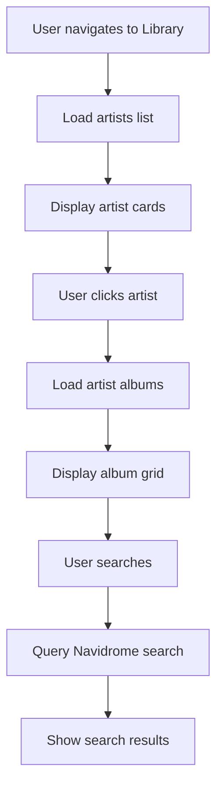

# AIDJ UI/UX Specification

## Introduction

This document defines the UX goals, information architecture, user flows, and design specs for AIDJ. It focuses on implemented features: authentication, dashboard, configuration, music library browsing with Navidrome integration, and audio playback. Planned: AI recommendations.

### Overall UX Goals & Principles

#### Target User Personas
- **Self-Hosted Music User:** Runs Navidrome for personal library; wants easy browsing, search, and streaming via web interface.
- **Music Enthusiast:** Browses artists/albums, plays tracks; values responsive UI and audio controls.
- **Privacy-Focused:** Local-only app, no cloud dependencies; configures services securely.

#### Usability Goals
- Ease of learning: New users can configure service connections and play music within 5 minutes
- Efficiency of use: Power users can quickly navigate between recommendations, library browsing, and download management
- Error prevention: Clear validation and feedback for service connection issues
- Memorability: Infrequent users can return without relearning core workflows
- Accessibility: Users with disabilities can fully access all functionality

#### Design Principles
1. **Simplicity over complexity** - Prioritize clear, straightforward workflows over feature density
2. **Consistent music experience** - Use familiar patterns from popular music applications
3. **Immediate feedback** - Every action related to service connections or music playback should have a clear, immediate response
4. **Progressive disclosure** - Show advanced configuration options only when needed
5. **Accessible by default** - Design for all users from the start with proper contrast and keyboard navigation

### Change Log
| Date | Version | Description | Author |
|------|---------|-------------|--------|
| 2025-09-06 | 1.0 | Initial UI/UX specification | Architect |

## Information Architecture (IA)

### Site Map / Screen Inventory


### Navigation Structure
**Primary Navigation:** Sidebar (desktop) or bottom tabs (mobile):
- Dashboard
- Library
- Config

**Secondary Navigation:** Contextual navigation within each section (e.g., sub-tabs for different library views)

**Breadcrumb Strategy:** Breadcrumb navigation for hierarchical views (e.g., Artists > Artist Name > Album Name > Song)

## User Flows

### Library Browsing Flow
**User Goal:** Browse artists, albums, search tracks

**Entry Points:**
- Dashboard library link
- Search bar

**Success Criteria:** Quick navigation to artists/albums; search returns relevant results



**Edge Cases & Error Handling:**
- Navidrome unreachable
- Empty library
- Large result sets (pagination)

**Notes:** Infinite scroll or pagination for large libraries; responsive grid layout.

### Audio Playback Flow
**User Goal:** Play selected track with controls

**Entry Points:**
- Click track in library/search
- Queue from artist/album

**Success Criteria:** Smooth streaming, persistent player, queue management

```mermaid
graph TD
    A[User clicks play] --> B[Fetch stream URL via API]
    B --> C[Set audio src to proxy stream]
    C --> D[Update audio store (Zustand)]
    D --> E[Show now playing bar]
    E --> F[User controls: play/pause/seek/volume]
    F --> G[Update progress, artwork]
```

**Edge Cases & Error Handling:**
- Stream fails (retry/reconnect)
- Auth token expires
- Network buffering

**Notes:** Persistent bottom player; mini-player in routes; waveform visualization planned.

### Configuration Flow
**User Goal:** Setup Navidrome connection

**Entry Points:**
- First login redirect
- Config route

**Success Criteria:** Test connection, save creds securely

```mermaid
graph TD
    A[User visits Config] --> B[Load saved creds (if any)]
    B --> C[Display form: URL, user, pass]
    C --> D[User submits]
    D --> E[Test connection via API]
    E --> F{Connected?}
    F -->|Yes| G[Save encrypted token]
    F -->|No| H[Show error, retry]
    G --> I[Success toast, redirect]
```

**Edge Cases & Error Handling:**
- Invalid creds
- Service unreachable
- Network timeout

**Notes:** Per-user config; test button with loading state.

## Wireframes & Mockups

### Design Files
**Primary Design Files:** Figma design files will be created for detailed visual designs

### Key Screen Layouts

#### Dashboard Screen
**Purpose:** App overview, quick library access, recent activity

**Key Elements:**
- Welcome message/user info
- Quick links: Library, Config
- Recent artists/albums cards
- Playback stats (planned)
- Now playing bar

**Interaction Notes:** Clean entry point post-login; cards link to library sections.

**Design File Reference:** Implemented in src/routes/dashboard/index.tsx

#### Library Screens
**Purpose:** Browse/search music collection

**Artist List (src/routes/library/artists.tsx):**
- Grid of artist cards (name, artwork)
- Search/filter bar
- Load more/pagination

**Artist Detail (src/routes/library/artists/[id].tsx):**
- Artist info, bio (planned)
- Album grid
- Top tracks

**Search (src/routes/library/search.tsx):**
- Unified search (artists/albums/tracks)
- Filters by type
- Results in tabs

**Interaction Notes:** Responsive grid; infinite scroll; click to drill down.

**Design File Reference:** Implemented with shadcn Card, TanStack Query

#### Config Screen
**Purpose:** Manage Navidrome connection, app settings

**Key Elements:**
- Navidrome: URL, username, password fields
- Test connection button
- Status badge (connected/disconnected)
- Theme toggle (dark/light)
- User profile link
- Save changes

**Interaction Notes:** Real-time validation; success/error toasts; secure cred handling.

**Design File Reference:** src/routes/config.tsx with shadcn Form/Input

## Component Library / Design System

### Design System Approach
**Design System:** shadcn/ui + Tailwind CSS v4; dark mode by default for music apps

### Core Components

#### Music Card
**Purpose:** Display artists/albums/tracks

**Variants:** Artist card, Album card, Track row
- Artist: Name, artwork, track count
- Album: Title, artist, year, artwork
- Track: #, title, duration, play button

**States:** Hover (scale), Loading (skeleton), Error (placeholder)

**Usage:** shadcn Card component; responsive grid/list toggle planned

#### Audio Player
**Purpose:** Global playback control

**Components:**
- Now playing bar (bottom persistent)
- Full player overlay (on focus)
- Controls: play/pause, prev/next, seek, volume slider
- Track info, queue list

**States:** Playing, paused, loading, error

**Usage:** Custom AudioPlayer.tsx; integrates with audio store; keyboard support (space=play)

#### Service Status Badge
**Purpose:** Navidrome connection status

**Variants:** Success (connected), Error (disconnected), Warning (testing)

**Usage:** shadcn Badge in config; updates on test/save; tooltip with last error

## Branding & Style Guide

### Visual Identity
**Brand Guidelines:** Modern, minimalist design with focus on music content. Dark theme optimized for extended listening sessions.

### Color Palette
| Color | Hex | Usage |
|-------|-----|-------|
| bg | #0f0f0f | Dark background |
| card | #1a1a1a | Cards/surfaces |
| primary | #3b82f6 | Blue accents (buttons, links) |
| text | #f8fafc | Primary text |
| muted | #94a3b8 | Secondary text |
| success | #10b981 | Connected/status |
| error | #ef4444 | Errors |

### Typography
#### Font Families
- **Primary:** "Inter", -apple-system, BlinkMacSystemFont, "Segoe UI", Roboto, sans-serif
- **Secondary:** "Inter", -apple-system, BlinkMacSystemFont, "Segoe UI", Roboto, sans-serif
- **Monospace:** "SF Mono", "Monaco", "Inconsolata", "Fira Mono", "Droid Sans Mono", "Source Code Pro", monospace

#### Type Scale
| Element | Size | Weight | Line Height |
|---------|------|--------|-------------|
| H1 | 24px | 700 | 1.2 |
| H2 | 20px | 700 | 1.3 |
| H3 | 18px | 600 | 1.4 |
| Body | 16px | 400 | 1.5 |
| Small | 14px | 400 | 1.4 |

### Iconography
**Icon Library:** Custom icon set based on Material Design icons with music-specific additions

**Usage Guidelines:** Use consistent stroke width and sizing. Ensure icons are meaningful and not overly complex.

### Spacing & Layout
**Grid System:** 8px grid system for consistent spacing

**Spacing Scale:** 4px, 8px, 16px, 24px, 32px, 48px, 64px

## Accessibility Requirements

### Compliance Target
**Standard:** WCAG 2.2 AA; follows shadcn/ui accessibility

### Key Requirements
**Visual:**
- Color contrast ratios: Minimum 4.5:1 for normal text, 3:1 for large text
- Focus indicators: Visible focus rings for all interactive elements
- Text sizing: Support for user-defined text scaling up to 200%

**Interaction:**
- Keyboard navigation: Full keyboard access to all functionality
- Screen reader support: Proper semantic markup and ARIA labels
- Touch targets: Minimum 44px by 44px for interactive elements

**Content:**
- Alternative text: Descriptive alt text for all meaningful images
- Heading structure: Proper heading hierarchy (H1-H6)
- Form labels: Explicit labels for all form controls

### Testing Strategy
Regular testing with screen readers, keyboard-only navigation, and automated accessibility tools. Include users with disabilities in usability testing.

## Responsiveness Strategy

### Breakpoints
| Breakpoint | Min | Max | Layout |
|------------|-----|-----|-------|
| sm | 640px | - | Mobile-first base |
| md | 768px | - | Tablet: sidebar -> bottom nav |
| lg | 1024px | - | Desktop: full sidebar |
| xl | 1280px | - | Wide: larger cards/grids |

### Adaptation Patterns
**Layout Changes:** 
- Single column layout on mobile
- Multi-column grid on tablet and desktop
- Sidebar navigation on desktop, bottom navigation on mobile

**Navigation Changes:** 
- Hamburger menu on mobile
- Persistent sidebar on desktop
- Contextual navigation in header

**Content Priority:** 
- Primary content always visible
- Secondary content accessible via tabs or accordions on mobile
- Full content visible on larger screens

**Interaction Changes:** 
- Touch-friendly controls on mobile
- Hover states on desktop
- Swipe gestures for navigation on mobile

## Animation & Micro-interactions

### Motion Principles
Animations: Tailwind transitions; subtle for music focus.

Key:
- Route changes: Fade/slide (300ms)
- Card hover: Scale 1.05 (150ms)
- Loading: shadcn skeletons
- Player: Progress bar fill, play icon rotate

## Performance Considerations

### Performance
- Vite: Instant HMR
- TanStack Query: Optimistic updates, caching
- Lazy load images (album art)
- Audio: Streamed, no preload
- Bundle: <1MB gzipped target

### Design Strategies
- Optimize images and artwork for web
- Implement lazy loading for content below the fold
- Use efficient component rendering patterns
- Minimize heavy animations that could impact performance
- Design with progressive enhancement in mind

## Next Steps

### Current Status
- [x] Auth screens (login/signup)
- [x] Dashboard layout
- [x] Library: artists list/detail, search
- [x] Config form
- [x] Audio player component
- [ ] AI recs UI (planned)
- [ ] Playlists/queue management

Design implemented via shadcn/ui in src/components/ui/