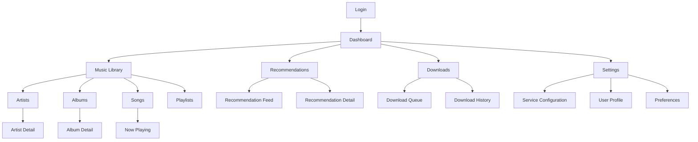
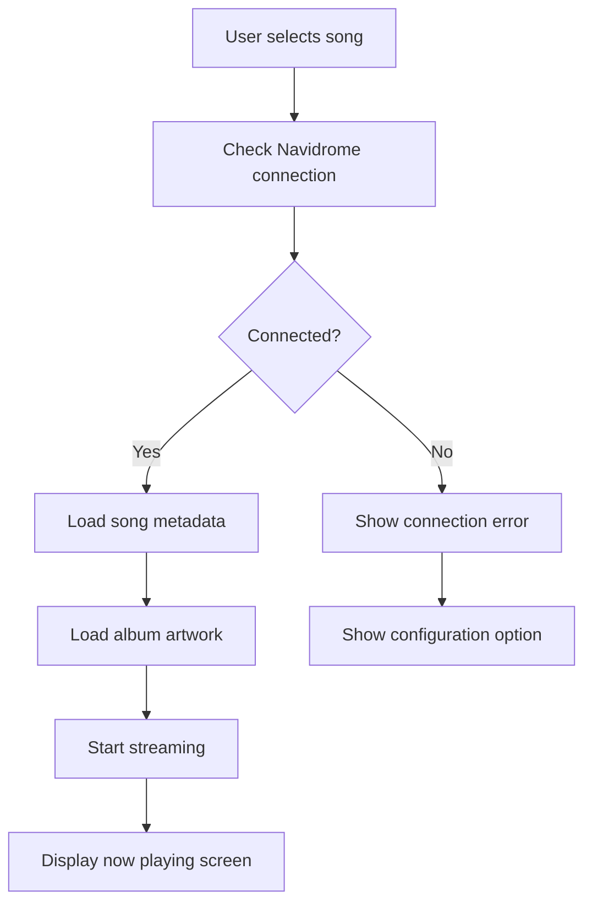
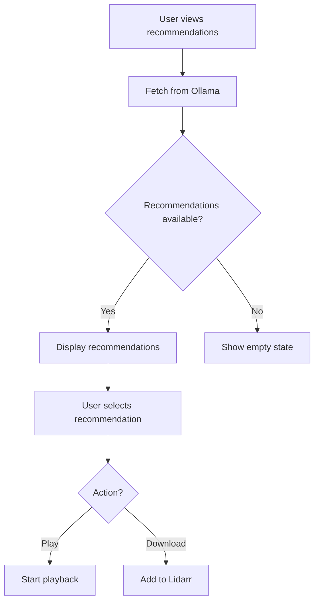
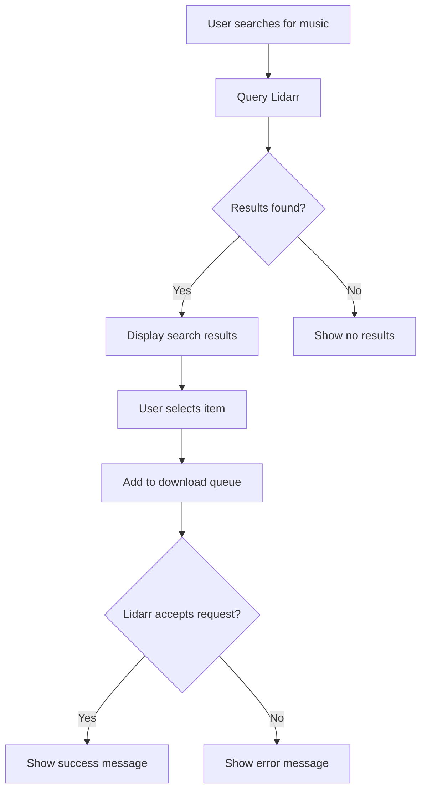

# Music Recommendation and Download Interface UI/UX Specification

## Introduction

This document defines the user experience goals, information architecture, user flows, and visual design specifications for the Music Recommendation and Download Interface's user interface. It serves as the foundation for visual design and frontend development, ensuring a cohesive and user-centered experience.

### Overall UX Goals & Principles

#### Target User Personas
- **Tech-Savvy Music Enthusiast:** Users who run self-hosted services (Ollama, Navidrome, Lidarr) and want a unified interface to manage their music collection. They value privacy, customization, and technical control over their media.
- **Music Collector:** Users with extensive music libraries who want to easily discover new music, manage their collection, and download new additions. They prioritize organization and efficiency.
- **Privacy-Conscious Listener:** Users who prefer to keep their music data local and avoid external services. They value applications that respect their privacy and data ownership.

#### Usability Goals
- Ease of learning: New users can configure service connections and play music within 5 minutes
- Efficiency of use: Power users can quickly navigate between recommendations, library browsing, and download management
- Error prevention: Clear validation and feedback for service connection issues
- Memorability: Infrequent users can return without relearning core workflows
- Accessibility: Users with disabilities can fully access all functionality

#### Design Principles
1. **Simplicity over complexity** - Prioritize clear, straightforward workflows over feature density
2. **Consistent music experience** - Use familiar patterns from popular music applications
3. **Immediate feedback** - Every action related to service connections or music playback should have a clear, immediate response
4. **Progressive disclosure** - Show advanced configuration options only when needed
5. **Accessible by default** - Design for all users from the start with proper contrast and keyboard navigation

### Change Log
| Date | Version | Description | Author |
|------|---------|-------------|--------|
| 2025-09-06 | 1.0 | Initial UI/UX specification | Architect |

## Information Architecture (IA)

### Site Map / Screen Inventory

### Navigation Structure
**Primary Navigation:** Bottom navigation bar on mobile, left sidebar on desktop with the following items:
- Dashboard (Home)
- Library
- Recommendations
- Downloads
- Settings

**Secondary Navigation:** Contextual navigation within each section (e.g., sub-tabs for different library views)

**Breadcrumb Strategy:** Breadcrumb navigation for hierarchical views (e.g., Artists > Artist Name > Album Name > Song)

## User Flows

### Music Playback Flow
**User Goal:** Find and play a song from the music library

**Entry Points:** 
- Library browsing (Artists, Albums, Songs)
- Search results
- Recommendation feed
- Playlist

**Success Criteria:** User can play a song with minimal steps and clear feedback

**Edge Cases & Error Handling:**
- Navidrome service is unreachable
- Song file is not available in Navidrome
- User has insufficient permissions
- Network connectivity issues

**Notes:** The playback experience should be seamless with minimal loading time. Visual feedback should indicate when a song is buffering.

### Recommendation Discovery Flow
**User Goal:** Discover new music through AI recommendations

**Entry Points:** 
- Dashboard recommendation feed
- Dedicated recommendations section
- After playing a song

**Success Criteria:** User can easily browse recommendations and either play or download suggested music

**Edge Cases & Error Handling:**
- Ollama service is unreachable
- No recommendations generated
- User has not configured Ollama connection
- Recommendation includes music not in library

**Notes:** Recommendations should be presented in an engaging visual format with album artwork. Users should be able to provide feedback on recommendations.

### Download Request Flow
**User Goal:** Request a new song or album for download through Lidarr

**Entry Points:** 
- Search interface
- Recommendation feed
- Album/Song detail pages

**Success Criteria:** User can search for music and successfully submit a download request to Lidarr

**Edge Cases & Error Handling:**
- Lidarr service is unreachable
- Search returns no results
- User has not configured Lidarr connection
- Item is already in download queue
- Lidarr rejects the request (e.g., quality profile mismatch)

**Notes:** The search interface should be responsive and provide clear feedback on the status of download requests.

## Wireframes & Mockups

### Design Files
**Primary Design Files:** Figma design files will be created for detailed visual designs

### Key Screen Layouts

#### Dashboard Screen
**Purpose:** Central hub for music discovery and quick access to key features

**Key Elements:**
- Header with user profile and search
- Recommendation feed with horizontally scrollable cards
- Quick access to recently played music
- Download queue status summary
- Now playing bar at bottom

**Interaction Notes:** The dashboard should load quickly and provide immediate value through recommendations and quick access to recent content.

**Design File Reference:** [Dashboard Screen - Figma Link]

#### Now Playing Screen
**Purpose:** Full-screen music playback experience

**Key Elements:**
- Large album artwork display
- Song title, artist, and album information
- Progress bar with time indicators
- Playback controls (play/pause, skip, previous)
- Volume control
- Queue display
- Lyrics display (if available)

**Interaction Notes:** Focus on the music playback experience with large, easy-to-tap controls. Visual design should adapt to album artwork colors.

**Design File Reference:** [Now Playing Screen - Figma Link]

#### Service Configuration Screen
**Purpose:** Configure connections to Ollama, Navidrome, and Lidarr services

**Key Elements:**
- Form fields for service URLs and credentials
- Connection test buttons for each service
- Status indicators for each service
- Save and cancel buttons
- Help text for configuration

**Interaction Notes:** Provide clear feedback on connection status. Validate inputs in real-time where possible.

**Design File Reference:** [Service Configuration Screen - Figma Link]

## Component Library / Design System

### Design System Approach
**Design System Approach:** Create a custom design system based on modern music application patterns with a focus on dark theme optimization

### Core Components

#### Music Card
**Purpose:** Display music content (songs, albums, artists) in a consistent format

**Variants:** 
- Compact (for lists)
- Standard (for grids)
- Large (for featured content)

**States:** 
- Default
- Hover
- Selected
- Loading
- Error

**Usage Guidelines:** Use consistent spacing and typography. Include album artwork when available. Show relevant metadata based on context.

#### Playback Controls
**Purpose:** Provide consistent playback controls throughout the application

**Variants:** 
- Full (play, pause, skip, previous, volume)
- Compact (play/pause, skip)
- Progress-only (progress bar with time)

**States:** 
- Playing
- Paused
- Loading
- Disabled

**Usage Guidelines:** Always show current playback state. Provide keyboard shortcuts where appropriate. Ensure adequate touch targets.

#### Service Status Indicator
**Purpose:** Show the connection status of integrated services

**Variants:** 
- Connected
- Disconnected
- Connecting
- Error

**States:** 
- Active
- Inactive
- Hover

**Usage Guidelines:** Use color coding for quick recognition. Provide tooltip with detailed status information on hover.

## Branding & Style Guide

### Visual Identity
**Brand Guidelines:** Modern, minimalist design with focus on music content. Dark theme optimized for extended listening sessions.

### Color Palette
| Color Type | Hex Code | Usage |
|------------|----------|-------|
| Primary | #1DB954 | Spotify green-inspired accent color for interactive elements |
| Secondary | #191414 | Dark background color |
| Accent | #FFFFFF | Light text and icons |
| Success | #1DB954 | Positive feedback, confirmations |
| Warning | #FF9800 | Cautions, important notices |
| Error | #F44336 | Errors, destructive actions |
| Neutral | #282828, #535353, #B3B3B3 | Backgrounds, borders, secondary text |

### Typography
#### Font Families
- **Primary:** "Inter", -apple-system, BlinkMacSystemFont, "Segoe UI", Roboto, sans-serif
- **Secondary:** "Inter", -apple-system, BlinkMacSystemFont, "Segoe UI", Roboto, sans-serif
- **Monospace:** "SF Mono", "Monaco", "Inconsolata", "Fira Mono", "Droid Sans Mono", "Source Code Pro", monospace

#### Type Scale
| Element | Size | Weight | Line Height |
|---------|------|--------|-------------|
| H1 | 24px | 700 | 1.2 |
| H2 | 20px | 700 | 1.3 |
| H3 | 18px | 600 | 1.4 |
| Body | 16px | 400 | 1.5 |
| Small | 14px | 400 | 1.4 |

### Iconography
**Icon Library:** Custom icon set based on Material Design icons with music-specific additions

**Usage Guidelines:** Use consistent stroke width and sizing. Ensure icons are meaningful and not overly complex.

### Spacing & Layout
**Grid System:** 8px grid system for consistent spacing

**Spacing Scale:** 4px, 8px, 16px, 24px, 32px, 48px, 64px

## Accessibility Requirements

### Compliance Target
**Standard:** WCAG 2.1 AA

### Key Requirements
**Visual:**
- Color contrast ratios: Minimum 4.5:1 for normal text, 3:1 for large text
- Focus indicators: Visible focus rings for all interactive elements
- Text sizing: Support for user-defined text scaling up to 200%

**Interaction:**
- Keyboard navigation: Full keyboard access to all functionality
- Screen reader support: Proper semantic markup and ARIA labels
- Touch targets: Minimum 44px by 44px for interactive elements

**Content:**
- Alternative text: Descriptive alt text for all meaningful images
- Heading structure: Proper heading hierarchy (H1-H6)
- Form labels: Explicit labels for all form controls

### Testing Strategy
Regular testing with screen readers, keyboard-only navigation, and automated accessibility tools. Include users with disabilities in usability testing.

## Responsiveness Strategy

### Breakpoints
| Breakpoint | Min Width | Max Width | Target Devices |
|------------|-----------|-----------|----------------|
| Mobile | 0px | 767px | Smartphones |
| Tablet | 768px | 1023px | Tablets |
| Desktop | 1024px | 1439px | Laptops, desktop monitors |
| Wide | 1440px | - | Large desktop monitors |

### Adaptation Patterns
**Layout Changes:** 
- Single column layout on mobile
- Multi-column grid on tablet and desktop
- Sidebar navigation on desktop, bottom navigation on mobile

**Navigation Changes:** 
- Hamburger menu on mobile
- Persistent sidebar on desktop
- Contextual navigation in header

**Content Priority:** 
- Primary content always visible
- Secondary content accessible via tabs or accordions on mobile
- Full content visible on larger screens

**Interaction Changes:** 
- Touch-friendly controls on mobile
- Hover states on desktop
- Swipe gestures for navigation on mobile

## Animation & Micro-interactions

### Motion Principles
Animations should be subtle, purposeful, and enhance the user experience without causing distraction. Use easing functions that feel natural and responsive.

### Key Animations
- **Page Transitions:** Slide transitions between main sections (Duration: 300ms, Easing: ease-in-out)
- **Button Feedback:** Subtle scale animation on button press (Duration: 150ms, Easing: ease-out)
- **Loading States:** Skeleton screens for content loading (Duration: 1000ms, Easing: linear)
- **Playback Visualization:** Animated equalizer during music playback (Duration: continuous, Easing: linear)

## Performance Considerations

### Performance Goals
- **Page Load:** First meaningful paint < 1.5 seconds
- **Interaction Response:** Click/tap response < 100ms
- **Animation FPS:** Maintain 60 FPS for all animations

### Design Strategies
- Optimize images and artwork for web
- Implement lazy loading for content below the fold
- Use efficient component rendering patterns
- Minimize heavy animations that could impact performance
- Design with progressive enhancement in mind

## Next Steps

### Immediate Actions
1. Create detailed visual designs in Figma based on this specification
2. Conduct usability testing with target users
3. Refine designs based on feedback
4. Prepare design handoff documentation for development team

### Design Handoff Checklist
- [x] All user flows documented
- [x] Component inventory complete
- [x] Accessibility requirements defined
- [x] Responsive strategy clear
- [x] Brand guidelines incorporated
- [x] Performance goals established

## Checklist Results
To be completed after design review and approval.