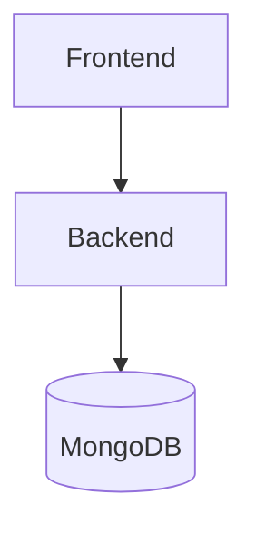

# Plan: Enable CORS and API base URL wiring for AI DJ

Scope
- Enable CORS on backend to allow frontend internal access
- Provide safe origins via env var
- Configure frontend to use a configurable API base URL
- Ensure Docker Compose wires environment vars and internal networking

Assumptions
- Docker Compose will run the backend as service name backend
- Frontend runs in Docker and can reach backend at http://backend:4000

Plan
1. Add CORS dependency and enable in backend
2. Read allowed origins from env
3. Update backend to handle /api/.. endpoints with CORS
4. Wire API_BASE_URL in frontend and post to abs URL
5. Update Docker Compose to pass API_BASE_URL to frontend
6. Sanitize error handling
7. Basic smoke tests
8. Documentation

Implementation notes
- backend references: [`backend/server.js`](backend/server.js:1)
- docker compose references: [`Docker-compose.yml`](Docker-compose.yml:1)
- frontend references: [`frontend/src/App.jsx`](frontend/src/App.jsx:1)

Proposed changes (high level)
- Install cors in backend
- In backend/server.js, add const cors = require('cors'); and app.use(cors({ origin: process.env.CORS_ORIGINS || true, credentials: true, methods: ['GET','POST','PUT','DELETE'] }));
- Read CORS_ORIGINS as comma-separated list
- Add API_BASE_URL env to frontend and default to http://backend:4000
- Update frontend App.jsx to post to `${API_BASE_URL}/api/ai-dj/expand`
- Ensure docker-compose env_file passes env vars

Diagram

Acceptance criteria
- Frontend can call /api endpoints from within Docker
- CORS configured with safe origins
- No leaking of internal errors

Risks and considerations
- Incorrect CORS configuration may block legitimate requests
- API_BASE_URL mismatch during local development

Notes
- Update README with run instructions

End plan